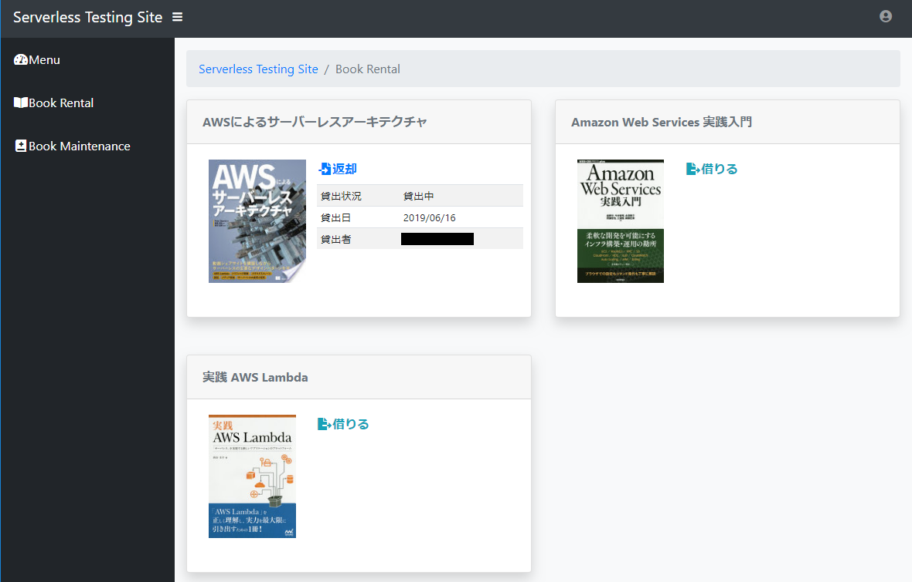
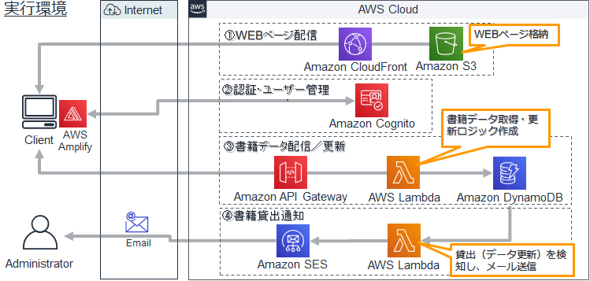

# AWS lambdaを使用したサーバレスサイト構築

## 作成するサイトイメージ


## サイト構成イメージ


## 環境準備
- 以下の環境をローカルに準備する。
  - Visual Studio Code
    - Nugetで以下のアドインを追加
      - Japanese Language Pack for Visual Studio Code
      - C# for Visual Studio Code
      - Vetur (vue tooling for VS Code)
  - Node.js
  - 本レポジトリを任意のフォルダにダウンロード
    - ksaplabobooks : Webアプリケーション(vue)
    - updateNotify_AwsLambda : Lambda関数

- VisualStudioCodeでダウンロードしたフォルダを開く。
- 「ターミナルを開く」を選択し、以下のコマンドを実行。
```
> npm install --save
```
- エクスプローラ上にnode_modules等のフォルダが追加される。
- 続いて、次のコマンドを実行する。  
```
> npm run build
```  
- 以下のメッセージがでて、distフォルダが作成されればOK。  
  途中、Lintのエラーがあるが、無視してよし。
```
DONE  Build complete. The dist directory is ready to be deployed.
INFO  Check out deployment instructions at https://cli.vuejs.org/guide/deployment.html
```

上記の作業で、distフォルダにフロントUIが生成されます。

## ①.WEBページ配信
### S3バケットを作成
#### AWS S3にバケットを作成し、Webフロントページのファイル、html/js/cssを格納します(環境準備で作成したdistフォルダ)
- ブラウザを起動し、AWSコンソールを起動する。
※ブラウザはGoogleChromeを推奨します。
- AWSコンソールからサービス「S3」を選択し、「バケットを作成」をクリック。
- 「名前とリージョン」画面で以下の内容を入力して「次へ」。
  - 「バケット名」：任意
  - 「リージョン」：「アジアパシフィック(東京)」
- 「オプションの設定」画面では、そのまま「次へ」。
- 「アクセス許可の設定」で「パブリックアクセスをすべてブロック」チェックを外して「次へ」。
- 「確認」画面で「バケットを作成」をクリック。
- 作成したバケットを選び、フォルダ「public」を作成。
- 作成したフォルダを選択し、「アップロード」を選択。
- 手順「環境準備」でビルドした「dist」フォルダの内容をドラッグドロップして、「次へ」。
- 「パブリックアクセス許可を管理する」に、「このオブジェクトに～権限を付与する」を選択して、「アップロード」をクリック。

以上でS3配置は完了。ブラウザから以下のアドレスにアクセスして、サインインのページが表示されればOK。  
　[http://[バケット名].s3-ap-northeast-1.amazonaws.com/public/pages/signin.html]([http://[バケット名].s3-ap-northeast-1.amazonaws.com/public/pages/signin.html])


### Cloud Front を設定
#### S3に格納したWebページをCloudFrontを介して配信し、HTTPSアクセスできるようにします。
- サービスから「CloudFront」を選択。
- 上部メニューから「Create Distribution」をクリック。
- 「Web」エリアの「Get Start」をクリック。
- 「Create Distribution」画面で「Origin Domain Name」に、前ページのバケットを選択。「Create Distribution」ボタンをクリック。
- Distributionの一覧で「Status」が「InProgress」から、「Deployed」になるまで待つ。
- 作成されたDistributionを選び、「Restrictions」をクリック。その後、「Edit」ボタンをクリックする。
- 「Enable Geo-Restriction」に「Yes」を指定。WhiteListに対して、下部「Countries」に「JP—JAPAN」をリスト追加し、「Yes,Edit」をクリックする。  
※これにより、海外からの不正なアクセスなどを制限できる  

以上でCloudFront設定は完了です。ブラウザから、CloudFrontのDomainNameに示されたアドレスに対してアクセスし、サインインページが表示されればOK。
　[https://[DomainName(～.cloudfront.net)]/public/pages/signin.html](https://[DomainName(～.cloudfront.net)]/public/pages/signin.html)

## ②.Cognitoでユーザ管理
### ユーザプールを作成
#### サイトへのログインユーザのサインアップ機能、ユーザ管理にCognitoを使用します。最初に、ユーザを管理するための「ユーザプール」を作成します。
- AWSコンソールで、リージョンに「東京」を指定。
- サービス「Amazon Cognito」を選択し、「ユーザプールの管理」をクリック。
- 「ユーザプールを作成」をクリック。
- 「プール名」は任意に指定し、「ステップに従って設定する」をクリック。
- 「属性」画面で「Eメールアドレスおよび電話番号」を選択。
  - 「必須」属性は「email」チェック、以下のカスタム属性を追加。
  - タイプ String、名前 yourname、1～256、変更可能 チェック
- 「ポリシー」画面のパスワード強度は任意。
- 「メッセージのカスタマイズ」はそのまま。  
※ここを変更すると、ユーザの確認メッセージメールの内容を変更できる。
- 「アプリクライアント」画面で、任意のアプリクライアント名を入力、「クライアントシークレットを生成」を外す。
- 「確認」画面で「プールの作成」をクリック。
- この後のIDプール作成で使用するため、次の情報を控える。
  - 「全般設定」画面の「プールID」
  - 「アプリクライアント」画面の「アプリクライアントID」

以上でユーザプールの作成は完了です。引き続き、「IDプールの作成」に進みます。

### IDプールを作成
#### ユーザプールに登録されるIDのプールを作成します。
- サービス「Amazon Cognito」を選択し、「IDプールの管理」をクリック。
- 「新しいIDプールの作成」をクリック。
- 「IDプール名」に任意の名称を設定。
- 「認証プロバイダー」を開き、「Cognito」を選択して、前の手順で控えた「ユーザプールID」「アプリクライアントID」を設定して、「プールの作成」ボタンをクリック。
- 確認画面「Your Cognito identities require access to your resources」が表示される場合、「許可」をクリック。
- 画面に表示される「AWS認証情報の取得」内の、「IDプールのID」を控える。

### WebアプリにCognito情報を設定(Visual Studio Code)
#### すでにアップロードしたWebサイトのソースを再度開いて Cognito情報を設定し、サインアップとの関連付けを行います。
- 自クライアントPCでVsCodeのソースから、「.env」ファイルを開き、以下の情報を設定して保存する。
```
VUE_APP_AWS_COGNITO_REGION="ap-northeast-1"  #1
VUE_APP_AWS_COGNITO_ID_POOL_ID=ap-northeast-1:xxxxxxxx-xxxx-xxxx-xxxx-xxxxxxxxxx  #2 
VUE_APP_AWS_COGNITO_USERPOOL_ID=ap-northeast-1_xxxxxxxx  #3
VUE_APP_AWS_COGNITO_USERPOOL_CLIENT_ID=xxxxxxxxxxxxxxxxxxxxxxxx #4 
```
1. `ap-northeast-1` (東京)を設定
2. 「IDプールの管理」、「IDプールのID」を設定
3. 「ユーザプールの管理」、全般タブの、「プールID」を設定
4. 「ユーザプールの管理」、アプリクライアントタブの、「アプリクライアントID」を設定
- ターミナルを開き、ビルドコマンドを実行。
```
　>npm run build
```
「dist」フォルダにビルド結果が保存される。
- 手順①を参考に、S3にファイルを再アップする。この時S3「public」フォルダ内の既存ファイルは全消しのうえ、アップロードしなおすこと。  
また、初回と同様に、パブリックアクセス件を付与することに注意。
- （次に「CloudFront」の配信キャッシュをクリアする）サービスからCloudFrontを選択する。
- 手順①で作成したDestributionを選択し「Invalidations」をクリック。	
- 「Create Invalidations」をクリックし、「Object Path」に、「/*」(すべて)を入力して「Invalidate」をクリック。

以上でWebアプリの再配信は完了です。再度ページにアクセスして、ログインを確認してみましょう。  

##### 確認手順
- アクセス先 [https://[DomainName(～.cloudfront.net)]/public/pages/signin.html](https://[DomainName(～.cloudfront.net)]/public/pages/signin.html)
- 「Register an Account」を選択する。
- ログインに使用するためのメールアドレス、パスワードを入力して「Register」ボタンをクリック。
- しばらくすると登録したメールアドレスに検証コード（6桁）が送付されてくる。
- ページに表示されている「Verify Key」に6桁の検証コードを入力して「Verify」ボタンをクリックする。
- ログイン画面から、登録したメールアドレスとパスワードを入力して「Login」をクリックし、「Serverless Testing Page」ページが表示されたらOK。

## ③書籍データ配信／更新
### DynamoDBにテーブルを作成する
#### 貸し出し状況を管理するためのテーブルを、DynamoDB上に作成します。
- AWSコンソールで「リージョン」を「アジアパシフィック(シンガポール)」に変更する。  
※2019/05現在、先日GAされた東京リージョンで環境を構築すると、Cloud9とうまく連携できないことがあったため、シンガポールとしています。
- サービスから「DynamoDB」を選択。
- 左のメニューから、「テーブルの作成」をクリック。
- 任意のテーブル名、プライマリキーに「title」(文字列)を設定して、「作成」ボタンをクリックする。
- 「項目の作成」ボタンをクリックし、「Tree」を「Text」に変更し、以下のJSONデータを張り付けて「保存」する。
```
{
 "description": "柔軟な開発を可能にするインフラ構築・運用の勘所。ブラウザでの設定もコマンド操作も丁寧に解説。",
 "imgUrl": "https://books.google.com/books/content?id=6LayjgEACAAJ&printsec=frontcover&img=1&zoom=1&source=gbs_api",
 "isbn": "9784774176734",
 "rentalDate": null,
 "rentalStatus": null,
 "rentalUser": null,
 "title": "Amazon Web Services 実践入門"
}
```
- 続いて貸し出し履歴テーブルを作成します。引き続き「テーブルの作成」をクリック。
- 任意の履歴テーブル名(～Historyなど)、プライマリキーに「rentalDateTime」(文字列)を設定して、「作成」ボタンをクリックする。

### AWSCodeStarで開発環境を構築
#### サーバサイドアプリをLambdaで開発するための環境を、AWS CodeStarで構築します。
- サービスの一覧から「AWS CodeStar」を選択する。
- 「新規プロジェクトの作成」をクリックする。
- プロジェクトのテンプレートから、以下を選択する。  
`Express.js + ウェブアプリケーション + AWS Lambda`
- 「プロジェクト詳細」画面で「プロジェクト名」を任意に設定
- 「レポジトリ」は「AWS CodeCommit」を選択
- そのまま「次へ」をクリックし、「プロジェクトを作成する」をクリックする。
- 「コードの編集の方法」画面では「AWS Cloud9」を選択する。
- 「インスタンスタイプ」には「t2.micro」を選択。  
※無償期間を過ぎている場合は、ここから有料になるので注意
- 「続行」をクリックすると、環境が自動で作成されるのでしばらく待つ。

### AWS Cloud9でサーバサイドアプリを作成
#### AWS Cloud9を起動し、LambdaからコールされるNode.jsアプリを開発する。
- 左メニューから「IDE」を選択し、表示されるプロジェクト名で「IDEを開く」を選択。
- 画面下のコンソールを選択し、指示どおりユーザ名とe-mailアドレスを入力してEnterを押下する。  
```
>ec2-user:~/environment$ git config --global user.name [ユーザ名]
>ec2-user:~/environment$ git config --global user.email [e-mailアドレス]
```
- プロジェクトに `.gitignore` ファイルを作成し、内容を以下のとおりとする。  
```
*node_modules/
```
これにより、node.jsのライブラリモジュールフォルダである、「node_modules」フォルダがgit管理から除外される。

- `package.json` を添付 `ksaplabobookslambda` プロジェクトの同ファイルで上書きする。
- `app.js` を添付 `ksaplabobookslambda` プロジェクトの同ファイルで上書きする。  
  ※ファイル内の「★テーブル名★」のところを、前述のdynamoDB内に作成したテーブル名に変更する。

- 画面下のコンソールを選択し、以下のコマンドを実行する。
```
>ec2-user:~/environment$ cd [プロジェクト名]
>ec2-user:~/environment/[プロジェクト名](master)$git add .
>ec2-user:~/environment/[プロジェクト名](master)$git commit -m 1st.
>ec2-user:~/environment/[プロジェクト名](master)$git push
```
- これにより、githubにソースがPushされ、自動的にビルド、デブプロイが実行される。
- CodeStar画面に切り替えると、右下に実行状況が表示される。デプロイが「成功」と表示されればOK。
- （以下、アクセス制限の変更）
- サービスから「IAM」を選択し、「ロール」から、「CodeStar-`[プロジェクト名]`-Exection」を選択する。
- 下部の「境界の削除」を選択する。確認メッセージも「削除」を選択する。
- 再びサービスを「CodeStar」の当該プロジェクトに戻し、画面右側にある、「アプリケーションのエンドポイント」のアドレスをコピー、そのアドレスに対して「/getall」を付与したアドレスに、ブラウザからアクセスする。
```
例）https://xxxxxx.execute-api.ap-southeast-1.amazonaws.com/Prod/getall
```
- この結果、dynamoDBに登録した内容がJSONで返却されれば、アプリとテーブルの関連が正しく行われている。
```
{"Items":[{"rentalDate":null,"isbn":"9784774176734","rentalStatus":null,"description":"柔軟な開発を可能にするインフラ構築・運用の勘所。ブラウザでの設定もコマンド操作も丁寧に解説。","rentalUser":null,"imgUrl":"https://books.google.com/books/content?id=6LayjgEACAAJ&printsec=frontcover&img=1&zoom=1&source=gbs_api","title":"Amazon Web Services 実践入門"}],"Count":1,"ScannedCount":1,"result":"success"}
```  
上記でエラーが出る場合は、サービス「CloudWatch」のログから、詳細を確認できるので、そちらで原因を探ってください。  
この状態で サイトにログインすると、「Book Rental」のページに「Amazon Web Services 実践入門」が表示されており、「借りる」を一回クリックすると貸し出し中へ、「返却」をクリックすると貸し出し可能に表示が切り替わる。

### Webアプリにアプリケーションのエンドポイント情報を設定(Visual Studio Code)
#### すでにアップロードしたWebサイトのソースを再度開いて アプリケーションのエンドポイント情報を設定し、サインアップとの関連付けを行います。
- 自クライアントPCでVsCodeのソースから、「.env」ファイルを開き、以下の情報を設定して保存する。
```
VUE_APP_SAP_BOOKS_SERVICE=https://xxxxxx.execute-api.ap-southeast-1.amazonaws.com/Prod
```
- 手順②と同様に `npm run build` でリビルドした後、S3への再アップロード、Cloud Frontの更新を行うこと。
- ブラウザから、Webサイトにアクセスし、貸し出し・返却、およびマスタ更新操作を確認する。

##### 確認手順
- アクセス先 [https://[DomainName(～.cloudfront.net)]/public/pages/signin.html](https://[DomainName(～.cloudfront.net)]/public/pages/signin.html)
- 手順②で登録したメールアドレス、パスワードを入力して「Login」ボタンをクリック。
- サイトメニュー左から、「BookRental」メニューを選択して右側に「Amazon Web Services実践入門」が表示されることを確認。
- 「借りる」リンクをクリックすることで、「貸出状況」が「貸出中」となり、「貸出日」に操作日、 「貸出者」にログインユーザが表示されることを確認。
- 「返却」リンクをクリックすることで、リンク内容が再度「借りる」に戻る(返却済)ことを確認。
- サイトメニュー左から、「Book Maintenance」メニューを選択して、「検索条件」欄に、「AWS」と入力し、「検索」ボタンをクリック。これにより、「AWS」という書籍名の一覧が最大10件まで画面に表示されることを確認。
- いずれかの書籍に対して「登録」をクリックすることで、「在庫」が「本棚にあります」となること、その本が「Book Rental」メニュー側に表示されることを確認。

## ④書籍貸出通知
### AWS Lambdaにメール通知の処理を追加する。
#### AWS Lambdaに関数を追加し、dynamoDBのレコード更新イベント(つまり、貸出・返却の操作)に応じて、管理者へメール通知が送られるような自動処理を追加します。
- サービスから「DynamoDB」を選択し、「テーブル」から前述の手順で作成したテーブルをクリックする。
- 「ストリームの管理」ボタンをクリックする。「表示タイプ」では「新旧イメージ」を選択して「有効化」をクリック。  
  これにより、テーブルのデータ更新が行われたタイミングで AWS lambda への通知が発信されるようになる。
- 次に、サービスから「AWS lambda」を選択し、「関数の作成」をクリックする。
- 「関数の作成」画面では、「一から作成」を選択する。関数名は任意。ランタイムは「Node.js 10.x」を選択して、「関数の作成」ボタンをクリックする。
- 「Desinger」エリアで「トリガーを追加」をクリックし、「トリガーの設定」画面で「DynamoDB」を選択する。「DynamoDB」テーブルには、前述の手順で「ストリームの管理を有効化したテーブル名が自動で表示されるので、「追加」をクリックする。
- `index.js` に、添付 `ksaplabobooksNotifylambda` プロジェクトの、同ファイル名の内容を上書きする。  
※スクリプト内の「★」の部分２か所に、発信元、送信先(サイト管理者)メールアドレスを入力してください。  
　後ほど、SESサービスでこのアドレスに対してメール通知許可設定を行うことになります。
- `moment.js` を追加し、添付 `ksaplabobooksNotifylambda` プロジェクトの、同ファイル名の内容を上書きする。
- 「環境変数」エリアに、`キー「TZ」、値「Asia/Tokyo」` を追加する。(履歴テーブルに設定される貸出日付を、日本標準時間とする)
- 「実行ロール」エリアにある、「既存のロール」から下部の「IAMコンソールで ～ ロールを表示します」をクリックする。
- IAM サービス画面で「+ インラインポリシーの追加」をクリックし、JSONで以下のポリシーを記述してポリシー追加する。
```
{
    "Version": "2012-10-17",
    "Statement": [
        {
            "Sid": "VisualEditor0",
            "Effect": "Allow",
            "Action": [
                "ses:Send*",
                "dynamodb:PutItem",
                "dynamodb:GetShardIterator",
                "dynamodb:DescribeStream",
                "dynamodb:ListStreams",
                "dynamodb:GetRecords"
            ],
            "Resource": "*"
        }
    ]
}
```
以上でLambda関数の作成は終了。テストを行う場合は、以下のテストコードを作成して実行する。
```
{
  "Records": [
    {
      "eventID": "1",
      "eventVersion": "1.0",
      "dynamodb": {
        "Keys": {
          "title": {
            "S": "AWSによるサーバーレスアーキテクチャ"
          }
        },
        "NewImage": {
          "rentalUser": {
            "S": "Test User"
          },
          "isbn": {
            "S": "9784798155166"
          },
          "rentalStatus": {
            "S": "貸出中"
          }
        },
        "OldImage": {
          "rentalUser": {
            "S": null
          },
          "isbn": {
            "S": null
          },
          "rentalStatus": {
            "S": null
          }
        },
        "StreamViewType": "NEW_AND_OLD_IMAGES",
        "SequenceNumber": "111",
        "SizeBytes": 26
      },
      "awsRegion": "us-west-2",
      "eventName": "MODIFY",
      "eventSourceARN": "eventsourcearn",
      "eventSource": "aws:dynamodb"
    }
  ]
}
```

### SESサービスで、メール通知許可設定を行う。
#### 自動メール配信をするためには、あらかじめSESサービス上で発信元、通知先メールアドレスに対してメール通知許可設定が必要です。SESサービスから承認メールを発信し、送信先アドレスから許可を行います。
- サービスから「Simple Email Service」を選択し、リージョンを「米国西部(オレゴン)」を選択する。
- 左メニューから「Identify Management」-「Email Address」を選択する。
- 「Verify a New Email Address」をクリックし、Emailアドレスを入力して、「Verify This Email Address」ボタンをクリックします。  
これにより、入力したアドレスに承認メールが送られますので、メーラから許可をクリックします。

##### 確認手順
- アクセス先 [https://[DomainName(～.cloudfront.net)]/public/pages/signin.html](https://[DomainName(～.cloudfront.net)]/public/pages/signin.html)
- 手順②で登録したメールアドレス、パスワードを入力して「Login」ボタンをクリック。
- サイトメニュー左から、「BookRental」メニューを選択、「借りる」・「返却」操作を行い、この結果、メールが通知されてくることを確認する。 
